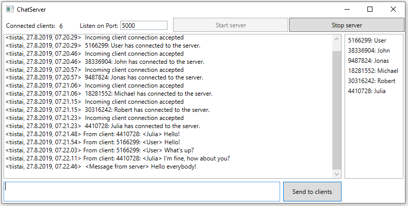

# chatServer
 
A simple TCP/IP based multithreading chat server application which is capable to handle more than one client at the same time. The server broadcasts all messages received from clients to all connected clients. There is not a private messaging possibility (yet). This server is meant to communicate with the chatClient app which is located in another repository linked below. 

Included features:
 - Kicking clients from the server (click the right mouse button on the listbox on the right side of the screen) 
 - Opens a file called logfile.txt when the app is opened and saves when the app is closed. If the file does not exist, a new file is created
 - Informs all clients when someone connects or disconnects
 
 

I made this for my personal learning purposes, so hope you can use this as the same way. Please, have fun!

C# WPF .NET Framework Application

ChatClient:

https://github.com/miikkamq/chatClient
